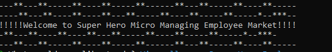
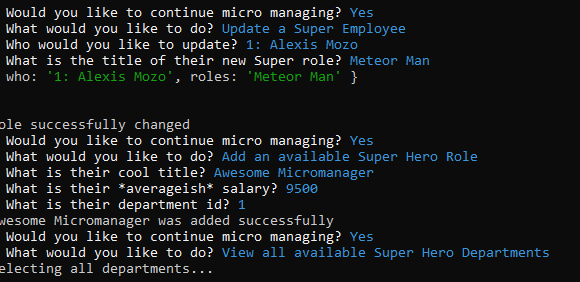
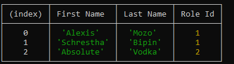

# Employee Tracker

## Description 
 

This assignment was a CMD line app using node.js, MySQL and Inquirer to get employee data, edit employee data and save it into a DB. 

## Table of Contents 

- [Description](#Description)
- [Installation](#installation)
- [Usage](#usage)
- [License](#license)
- [Instructions](#Instructions)
## Installation

Install node, MySQL, and Inquirer by doing "npm install {package name here}" while you have a terminal prompt up in the file directory.

## Usage

I would use this to maybe edit small employee data that always changes.

## License

 

## Instructions

To begin, do a npm install and install the required modules first. After that, node.js app.js will begin the application and start asking questions. The questions are asked in the form of a scroll wheel, just use the UP or DOWN arrow keys and ENTER to select your option. If you finish too early, you can just repeat the steps and everything you already logged and stored in the DB will still be there. 

 

 

 

## GitHub

If you would like to vist my profile please feel free!
[GitHub Profile](https://github.com/savagescoles)

